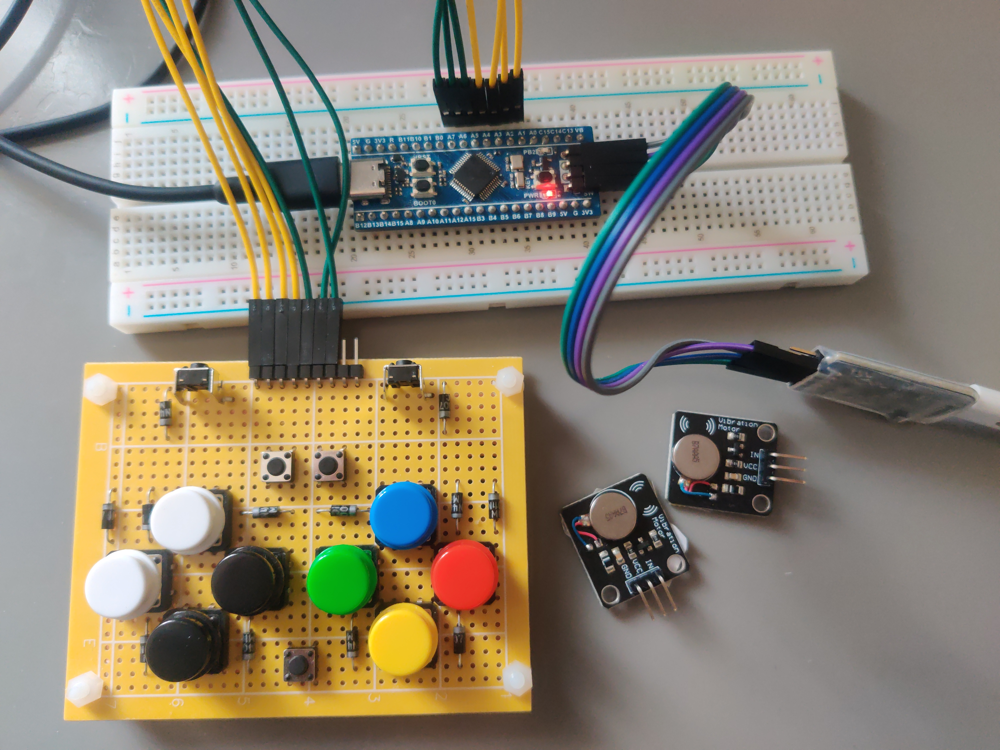

# em-usb-pad

This is an experimental personal project about implementing a gamepad firmware using xbox360 controller's protocol with embassy.

By the time there is only a proof of concept version on STM32F103/BluePill.

## How to run it

The supported way:

- setup rust toolchain
- install `probe-run` by running `cargo install probe-run`
- clone the repository
    - sync the submodule `git submodule update --init`
- connect your debugger to your board
    - also remember to connect them to your computer
- run `cargo run`
- test your gamepad
